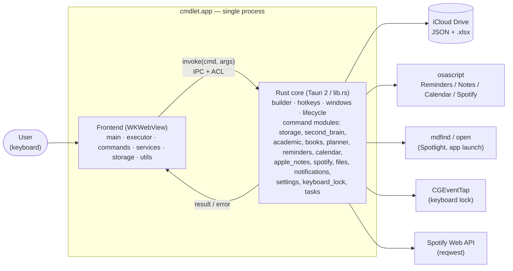

# cmdlet — Architecture

> Audience: engineers extending or maintaining cmdlet. This describes the runtime shape of the
> system, the layer boundaries, and how a keystroke becomes a side effect. For the *why* behind the
> decisions (and operational concerns), see [`system-design.md`](./system-design.md).

## 1. Tech stack & process model

cmdlet is a **Tauri 2** desktop app: one native process hosting a WKWebView.

- **Backend** — Rust (`src-tauri/`), compiled to a `staticlib`/`cdylib`/`rlib`. Owns the OS:
  windows, the global hotkey, file I/O, AppleScript, Spotlight, the keyboard-lock event tap, and
  HTTP to the Spotify API. Exposes capabilities to the front end as `#[tauri::command]` functions.
- **Frontend** — TypeScript + Vite, **no UI framework** (`src/`). Plain DOM. Bundled by Vite into
  `dist/` and embedded in the binary at build time. Talks to the backend exclusively through the
  Tauri `invoke` IPC bridge (`withGlobalTauri: true`).
- **Boundary** — the only channel between the two is `invoke(commandName, args)` → a Rust command
  allowlisted by the window's capability. There is no shared memory and no direct filesystem access
  from the webview.

> More views (frontend dispatch, the workbook write pipeline, the permission model, the data model)
> are collected in [`diagrams.md`](./diagrams.md).



## 2. Frontend layers

| Layer | Files | Responsibility |
| --- | --- | --- |
| Shell / UI | `index.html`, `src/main.ts`, `src/styles.css` | The palette window: show/hide on `palette-shown`, input handling, session history rendering, dynamic window resizing, autofocus, blur-to-hide, `⌘Q` quit |
| Dispatch | `src/executor.ts`, `src/autocomplete.ts` | `parseInput` splits `name` + `args`; `resolveCommand` looks it up (incl. aliases); `executeCommand` runs it and threads the **follow-up** state machine; autocomplete computes command/arg completions and the longest common prefix for Tab |
| Commands | `src/commands/*` + `commands/catalog.ts` + `commands/index.ts` | One `Command` object per feature (`{ name, category, description, execute(args), complete?(prefix) }`). `catalogCommands` is the registry; `resolveCommand` is rebuilt per call so HMR picks up new commands |
| Services | `src/services/*` | The Excel subsystem: `excel.ts` (ExcelJS ⇄ base64 IPC primitives), `secondBrain.ts` (workbook schema, sheet builders, the serialized write engine), `sheetRowIO.ts` + `excelRowSchemas.ts` (declarative per-sheet forms), `excelColors.ts` (group coloring), `excelSync.ts` (error-wrapped sync helpers) |
| Storage bridges | `src/storage/*` | Thin `invoke` wrappers: `service.ts`/`jsonStore.ts` (allowlisted JSON r/w), `settingsStore.ts`, `reminderStore.ts`, `calendarStore.ts`, `noteStore.ts` |
| Utilities | `src/utils/*` | `dateParser.ts` (natural-language dates/times/durations), `hubParser.ts`/`hubExecute.ts` (intent parsing for reminder/event/note), `parseArgs.ts`, `excelRowPrompt.ts`/`sheetEditPrompt.ts` (drive the follow-up forms), `upcomingSchedule.ts` (recurrence expansion) |

### Core frontend patterns

- **Command pattern.** Every feature is a stateless `Command`; the executor is a generic dispatcher.
  Adding a command = add a file + register it in `catalog.ts`.
- **Interactive follow-up state machine.** A command may return `{ output, followUp, hint }` instead
  of a string. The executor stashes `activeFollowUp`; the next keystroke-submitted line is routed to
  it instead of being parsed as a new command. This powers multi-field forms and pick-from-list
  disambiguation. Follow-up state is cleared when the palette hides or a plain string is returned.
- **Declarative sheet forms.** `excelRowSchemas.ts` defines fields/labels/hints per sheet; generic
  `readFormRowValues`/`applyFormRowValues` in `sheetRowIO.ts` handle every sheet polymorphically by
  `SheetFormId`.

## 3. Backend modules

`lib.rs` is the composition root: it builds the Tauri app, registers the global shortcuts, declares
the two windows, runs the `setup` hook (storage init + legacy migration + a deferred "Cmdlet
calendar missing?" check), sets the **Accessory** activation policy (no Dock icon), and lists every
command in `invoke_handler![…]`.

| Module | Responsibility |
| --- | --- |
| `storage.rs` | iCloud folder resolution, allowlisted JSON read/write, default seeding, legacy→iCloud migration |
| `second_brain.rs` | Workbook file I/O: atomic writes, editor-lock detection (`lsof` + Office `~$` lock), base64 IPC, template seeding |
| `academic.rs` / `planner_data.rs` / `planner.rs` | Planner CRUD (classes/assignments/exams/notes) over `planner.json`; dashboard text + JSON export |
| `books.rs` / `tasks.rs` | Book catalog + reading progress; local task list |
| `reminders.rs` / `apple_notes.rs` / `calendar.rs` | macOS PIM integration via AppleScript; each backed by a capped local `*-history.json` (`reminder_history.rs`, `note_history.rs`, `event_history.rs`) |
| `spotify.rs` | Spotify search (Web API, client-credentials) + playback (AppleScript) |
| `files.rs` | Spotlight search (`mdfind`) + open-by-path |
| `notifications.rs` | Banner notifications + an "urgent" mode (`caffeinate` + `afplay` + modal dialog) that bypasses Focus |
| `keyboard_lock.rs` | System-wide keyboard suppression via a `CGEventTap` on a dedicated run-loop thread; gated on Accessibility |
| `settings.rs` | Typed settings over `settings.json` |
| `lib.rs` (inline) | `open_app`, `web_search`, `clipboard` (`pbcopy`/`pbpaste`), `start_timer`, `spotify_control`, `quit_app`, `lock_keyboard`/`unlock_keyboard` |

### Windows

- **`main`** — 920×72, transparent, borderless, always-on-top, `skipTaskbar`, hidden at launch. The
  palette. Toggled by the global shortcut; closing it merely hides it (`prevent_close` + `hide`).
- **`lock`** — 320×200, loads `lock.html`. Shown only while the keyboard lock is engaged.

## 4. End-to-end flow: `task add Study | School | 2026-06-20`

```
keydown(Enter) ── main.ts ──► executor.executeCommand(line)
   │  no active follow-up → parseInput → resolveCommand("task")
   ▼
task.execute("add Study | School | 2026-06-20")
   │  parseSubcommand → action="add"; completeSheetRowPrompt("tasks", rest, submitTaskRow)
   │  prompts remaining fields via the follow-up state machine (returns {output, followUp, hint})
   ▼ (on final field)
submitTaskRow(values)
   ├─ writeSheetFormRow("tasks", values)  ── services/secondBrain.ts
   │     └─ withWorkbook(mutate):                       // serialized write chain
   │          workbookExists()? ── invoke second_brain_exists
   │          if missing → invoke seed_second_brain_from_template (else code-gen)
   │          readWorkbook() ── invoke read_second_brain_base64 → ExcelJS.load
   │          ensureWorkbookSheets(); applyFormRowValues(...); recolor
   │          writeWorkbook() ── ExcelJS.writeBuffer → base64 → invoke write_second_brain_base64
   │               └─ Rust write_bytes_atomic: refuse if open in Excel; temp+fsync+rename; retry×4
   └─ invoke create_task / create_reminder  ── tasks.rs / reminders.rs (+ history)
   ▼
returns "Added …" → executor clears follow-up → main.ts appends to session history
```

The two notable mechanics visible here — the **template-seed-then-fallback** on first materialization
and the **single serialized write chain** that guards the workbook — are detailed in
[`system-design.md`](./system-design.md) §2–§3.

## 5. The IPC bridge & permission model (summary)

`invoke` is mediated by Tauri 2's **capability/ACL** system. A window can only call commands granted
to it:

- `capabilities/default.json` binds the `main` window to `core:*` window/event/global-shortcut
  permissions plus one `allow-<feature>` per subsystem.
- `capabilities/lock.json` binds the `lock` window to just `allow-keyboard-lock`.
- Each `permissions/<feature>.toml` enumerates the exact command names it unlocks.

So the front end physically cannot invoke a Rust command that isn't in its window's grant set. See
[`system-design.md`](./system-design.md) §5 for the security rationale.

## 6. Module/file index

| Concern | Frontend | Backend |
| --- | --- | --- |
| Palette UI / dispatch | `main.ts`, `executor.ts`, `autocomplete.ts` | `lib.rs` (windows, hotkeys, lifecycle) |
| Commands | `commands/*`, `commands/catalog.ts` | the `invoke_handler!` list in `lib.rs` |
| Excel workbook | `services/excel.ts`, `services/secondBrain.ts`, `services/sheetRowIO.ts`, `services/excelRowSchemas.ts` | `second_brain.rs` |
| Planner / academic | (via `storage/*`) | `academic.rs`, `planner.rs`, `planner_data.rs` |
| JSON persistence | `storage/service.ts`, `storage/jsonStore.ts` | `storage.rs` |
| PIM (reminders/notes/cal) | `storage/reminderStore.ts`, `storage/noteStore.ts`, `storage/calendarStore.ts` | `reminders.rs`, `apple_notes.rs`, `calendar.rs` (+ `*_history.rs`) |
| Settings | `storage/settingsStore.ts` | `settings.rs` |
| Keyboard lock | `lock.html` | `keyboard_lock.rs` |
