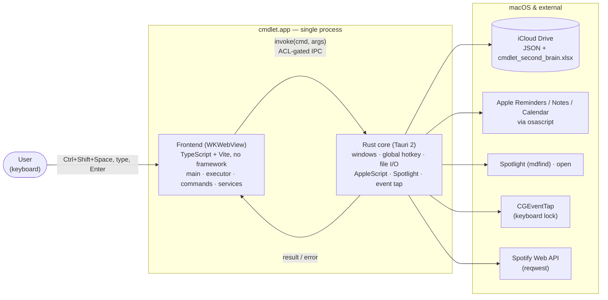
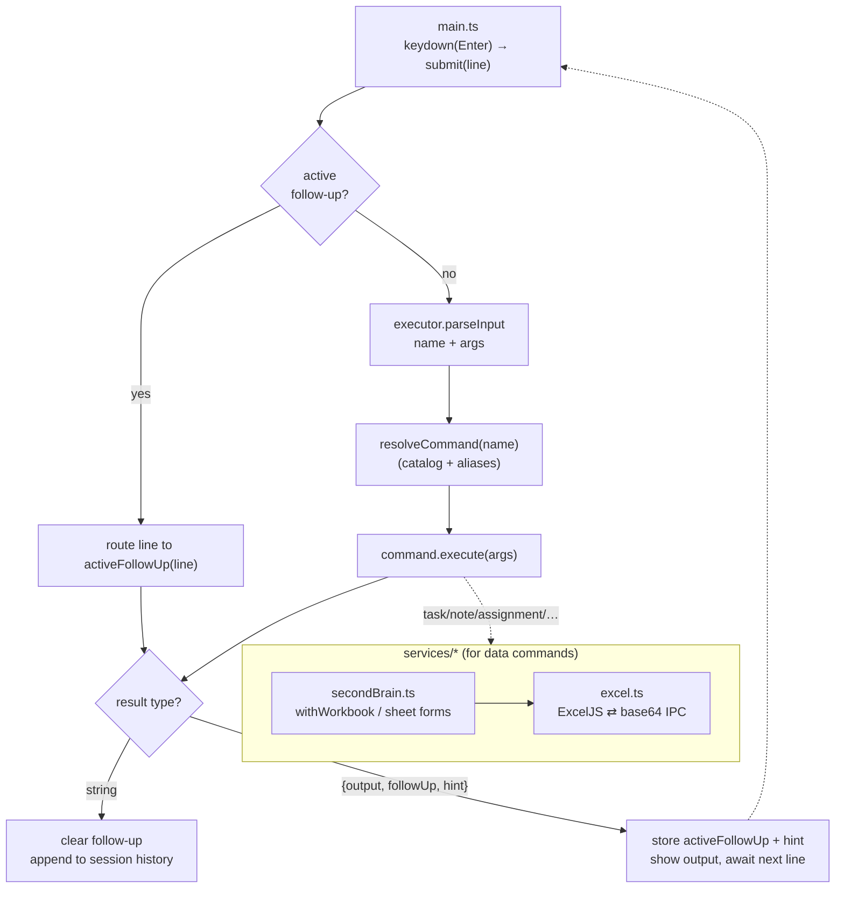
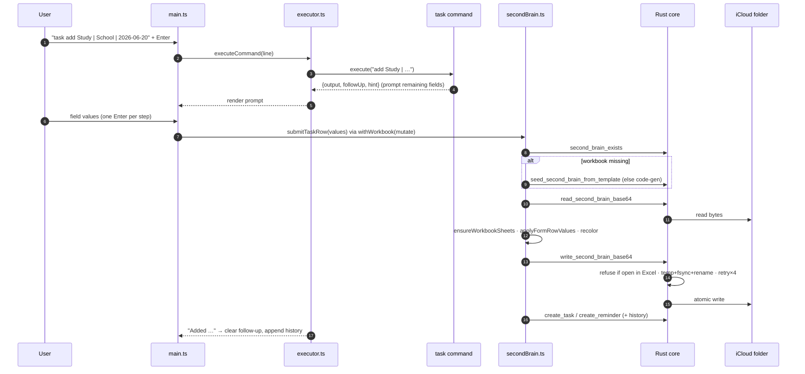
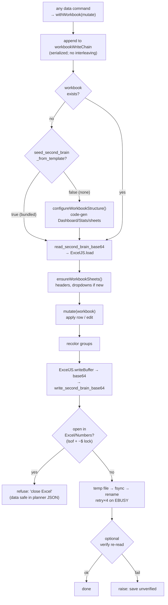
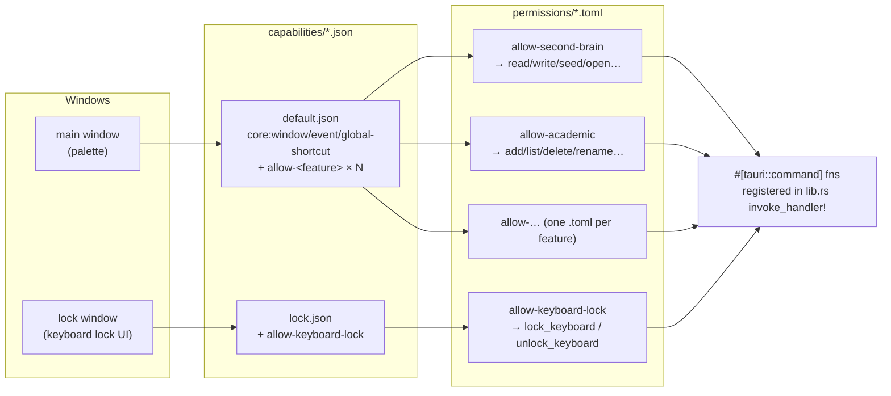
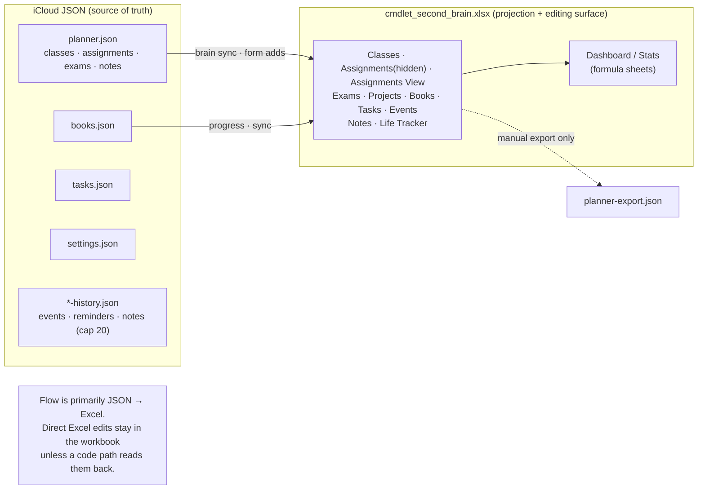

# cmdlet — Architecture Diagrams

GitHub-renderable Mermaid. Pair with [`architecture.md`](./architecture.md) (structure) and
[`system-design.md`](./system-design.md) (rationale). Diagrams are deliberately kept at the
component level — file-level detail lives in the architecture file index.

---

## 1. System context / containers

The whole app is one process: a WKWebView frontend and a Rust core, with the OS and external
services around it. The webview reaches the core only through the ACL-gated `invoke` bridge.

---

## 2. Frontend layers & dispatch

A keystroke is parsed, routed to a `Command`, and either returns a string (done) or a follow-up
handler that captures the next line (multi-step forms, pick-from-list).

---

## 3. Command execution — end to end (`task add`)

---

## 4. Workbook write pipeline

Every mutation funnels through one serialized chain; first materialization prefers the bundled
template; the Rust write is atomic and refuses to clobber a live editor.

---

## 5. Permission / capability model (Tauri ACL)

The webview can invoke only the commands its window's capability grants. Adding a command means
touching all three layers.

---

## 6. Data model — JSON authoritative, Excel as projection

