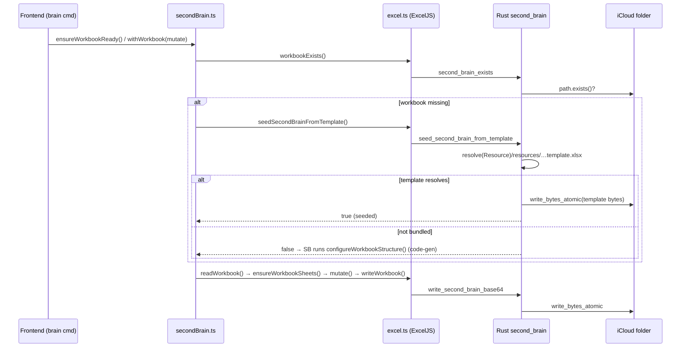

# Second Brain — Workbook Bootstrap & Template Seeding

**Status:** Implemented
**Scope:** How the `cmdlet_second_brain.xlsx` workbook is created on first run, why it is seeded
from a bundled template instead of generated in code, and how to maintain that template.
**Audience:** Engineers working on the second-brain / Excel-sync subsystem.

---

## 1. Problem

The second brain is a single Excel workbook synced through iCloud Drive. Historically, a fresh
install generated the workbook **entirely in code** (`configureWorkbookStructure`): headers,
dropdowns, dashboard formulas, stats formulas. That works for a flat schema but cannot reproduce
manual Excel artifacts that the owner had built up in their real workbook — specifically:

- An **"Assignments View"** sheet: a single modern dynamic-array spill
  (`SORTBY(FILTER(Assignments!…))`) that presents the (now **hidden**) raw `Assignments` sheet
  sorted by status then due date.
- Custom zoom, frozen panes, column widths, and sheet ordering.

ExcelJS — the only writer available on the frontend — cannot author a `_xlfn`/`_xlfn._xlws`
dynamic-array formula from scratch reliably, and reproducing every cosmetic detail in code is
brittle. We want a new user's first workbook to match the curated layout exactly, **minus any
personal data**.

## 2. Decision

Ship a **data-stripped copy of the curated workbook as a bundled resource** and copy it into place
on first run. Code generation remains as a fallback for builds that don't ship the template.

- Single source of truth for layout = the binary template (`second_brain_template.xlsx`).
- Code generator (`configureWorkbookStructure`) is now the *fallback*, not the primary path.

Trade-off accepted: one binary asset in the repo, and the template must be regenerated by hand when
the canonical layout changes (see §7).

## 3. Storage model (unchanged)

There is **one workbook per machine**, at a fixed path. There is no multi-user / multi-profile
concept — "another person" means a different macOS user / iCloud account, each with their own
single workbook.

| Concern | Location |
| --- | --- |
| Workbook path | `$HOME/Library/Mobile Documents/com~apple~CloudDocs/Cmdlet/cmdlet_second_brain.xlsx` |
| Resolver (Rust) | `second_brain.rs::workbook_path()` → `storage::icloud_storage_dir()` + `WORKBOOK_NAME` |
| Resolver (TS) | `getWorkbookPath()` → invoke `second_brain_workbook_path` |

Writes are **atomic** (`write_bytes_atomic`): write to `.<name>.tmp`, `fsync`, `rename`. Before
writing, `workbook_open_in_editor` probes via `lsof` (and the Office `~$` lock file) for Excel /
Numbers / LibreOffice holding the file, and refuses rather than silently losing rows on the
editor's next save. Reads/writes retry on `EAGAIN`/`EACCES` (`WRITE_RETRIES = 4`).

## 4. Components added

### 4.1 Bundled resource

- File: `src-tauri/resources/second_brain_template.xlsx`
- Declared in `src-tauri/tauri.conf.json` → `bundle.resources`.
- At runtime it lands at `cmdlet.app/Contents/Resources/resources/second_brain_template.xlsx`
  (the declared relative path is preserved under the Resource base dir).

### 4.2 Rust command — `seed_second_brain_from_template`

`src-tauri/src/second_brain.rs`

```rust
const TEMPLATE_RESOURCE: &str = "resources/second_brain_template.xlsx";

#[tauri::command]
pub fn seed_second_brain_from_template(app: AppHandle) -> Result<bool, String> {
    let path = workbook_path()?;
    if path.exists() { return Ok(false); }                 // never clobber an existing workbook
    let template = match app.path()
        .resolve(TEMPLATE_RESOURCE, tauri::path::BaseDirectory::Resource) {
        Ok(p) if p.exists() => p,
        _ => return Ok(false),                             // no template shipped → caller falls back
    };
    let bytes = fs::read(&template).map_err(…)?;
    write_bytes_atomic(&path, &bytes)?;                    // reuse atomic + editor-lock guard
    Ok(true)
}
```

Contract: **`true`** = a fresh workbook was created from the template; **`false`** = a workbook
already exists *or* no template is bundled. `false` is the signal to fall back to code generation.

Wiring:
- Registered in `lib.rs` `invoke_handler!`.
- Allow-listed in `src-tauri/permissions/second-brain.toml` (`allow-second-brain`).

### 4.3 TS bridge — `seedSecondBrainFromTemplate()`

`src/services/excel.ts` — thin `invoke<boolean>("seed_second_brain_from_template")` wrapper.

### 4.4 Integration points (`src/services/secondBrain.ts`)

Seeding is attempted at **every place a missing workbook is materialized**, so no entry point can
bypass it:

| Caller | When it runs | Behavior |
| --- | --- | --- |
| `ensureWorkbookReady()` | before reads/syncs (via `tryExcelSync` in `excelSync.ts`) | seed → else `initSecondBrain()` |
| `initSecondBrain()` | `brain init` command | seed → else code-gen + write |
| `performWorkbookWrite()` | every serialized write (`withWorkbook`) | seed → mark exists → `ensureWorkbookSheets`; else code-gen |

`performWorkbookWrite` is the critical one: form-add paths (`writeSheetFormRow`, `addAssignmentRow`,
…) call `withWorkbook` directly **without** `ensureWorkbookReady`, so the seed guard lives in the
write itself.

`SHEET.ASSIGNMENTS_VIEW = "Assignments View"` was added to the `SHEET` map and to `SHEET_ORDER`
(between `ASSIGNMENTS` and `EXAMS`). `sortWorkbookSheets` sorts by `SHEET_ORDER.indexOf(name)`; an
unknown sheet returns `-1` and would be yanked to the front on the next write. Registering it keeps
the View beside Assignments.

## 5. Control flow



## 6. The template's contents

13 sheets, in `SHEET_ORDER`: `Dashboard, Classes, Assignments (hidden), Assignments View, Exams,
Projects, Books, Tasks, Events, Notes, Life Tracker, Stats`.

- **Data sheets** (`Classes`, `Assignments`, `Exams`, …): header row only, **zero data rows**.
- **`Assignments View`**: header row + the array-formula anchor at `A2`
  (`<f t="array" ref="A2:H48">_xlfn.SORTBY(_xlfn._xlws.FILTER(Assignments!A2:H1000, …))</f>`),
  cached spill values removed. Excel recomputes the spill on open; against an empty `Assignments`
  sheet it yields an empty result.
- **`Dashboard` / `Stats`**: layout + `COUNTIFS`/`SUMIFS` formula cells retained (they reference
  other sheets and evaluate to 0 on an empty workbook).
- `sharedStrings.xml` pruned to the strings actually referenced (headers + dashboard/stats labels);
  the owner's assignment/course titles were removed entirely (not just dereferenced).

### Round-trip safety

The app re-serializes the workbook through ExcelJS on **every write**. Verified that ExcelJS
preserves the dynamic-array formula across read→write (`cell.model.shareType === "array"`,
`ref` retained). So the View sheet keeps working after the first Cmdlet write. The on-disk byte size
changes after the first write (ExcelJS re-emits the archive) — this is expected and not a
regression; assert on **content**, not file size.

## 7. Runbook — regenerating the template

Do this when the canonical layout changes. **Do not** strip rows by round-tripping the live workbook
through ExcelJS — its writer drops the `_xlfn` dynamic-array metadata. Edit the OOXML directly.

1. Start from the curated live workbook (`…/Cmdlet/cmdlet_second_brain.xlsx`). `unzip` it.
2. Map sheet name → file via `xl/workbook.xml` (`<sheet>` order = rId) and
   `xl/_rels/workbook.xml.rels` (rId → `worksheets/sheetN.xml`). **Note:** the sheet *file* number
   is not the tab order; resolve it through the rels.
3. For each pure **data sheet**, delete every `<row>` element with `r != 1`; shrink `<dimension>` to
   the header range.
4. For **`Assignments View`**: keep rows 1–2, drop rows ≥ 3, and inside `A2` keep `<f …>…</f>` but
   delete its cached `<v>…</v>`. Leave `cm="…"` (cell-metadata ref into `metadata.xml`).
5. **Prune `sharedStrings.xml`**: collect indices referenced by `t="s"` cells across all sheets,
   rebuild `<sst>` with only those `<si>` in ascending order, remap each `t="s"` cell's `<v>` to the
   new index, and fix the `count`/`uniqueCount` attributes. (Inline `t="str"` formula results are
   not shared-string indices — leave them.)
6. `calcChain.xml` stays valid as long as you don't remove **formula** cells (stripped data cells are
   values). If you ever do, delete `calcChain.xml` and let Excel rebuild it.
7. Re-zip with `[Content_Types].xml` first, then `_rels docProps xl`. Verify with ExcelJS:
   0 data cells outside Dashboard/Stats/View, `Assignments View!A2` formula contains `FILTER`,
   `Assignments` sheet `state === "hidden"`.
8. Copy to `src-tauri/resources/second_brain_template.xlsx`.

## 8. Known limitations

- **No data validations (dropdowns).** The source workbook had already lost its list validations
  (Status / Priority / Mood / etc.) during a prior repair, so the template has none. Because
  `setupDataSheet` only adds validations `if (!isSheetInitialized(sheet))` and the template's sheets
  *are* initialized (headers present), code never re-adds them to a template-seeded workbook. To
  restore dropdowns, add them to the template XML (`dataValidations`), not to the code path.
- The template is a binary blob — diffs are opaque; rely on the §7 verification, not code review of
  the bytes.
- `brain init` run against an **existing** workbook still calls `configureWorkbookStructure`, which
  rebuilds Dashboard/Stats from code. That can diverge from a template's hand-tuned dashboard. If the
  template's dashboard must be authoritative, gate that rebuild too.

## 9. Verification performed

Build: `npm run tauri:build` (signed "Cmdlet Dev Signing"; `codesign --verify` passes and satisfies
the designated requirement, so the Accessibility grant survives the rebuild).

End-to-end first-run: moved the real workbook aside, launched the installed `.app`, ran `brain init`,
and confirmed the seeded file contained the `Assignments View` formula sheet + hidden `Assignments`
(neither of which code-gen produces) with **0 personal data cells**; then restored the original
byte-identical (`cmp`).

## 10. Touchpoints (file index)

| File | Change |
| --- | --- |
| `src-tauri/resources/second_brain_template.xlsx` | new bundled template |
| `src-tauri/tauri.conf.json` | `bundle.resources` entry |
| `src-tauri/src/second_brain.rs` | `seed_second_brain_from_template` + `TEMPLATE_RESOURCE` |
| `src-tauri/src/lib.rs` | command registration |
| `src-tauri/permissions/second-brain.toml` | command allow-list |
| `src/services/excel.ts` | `seedSecondBrainFromTemplate()` bridge |
| `src/services/secondBrain.ts` | seed in `ensureWorkbookReady` / `initSecondBrain` / `performWorkbookWrite`; `ASSIGNMENTS_VIEW` in `SHEET` + `SHEET_ORDER` |
